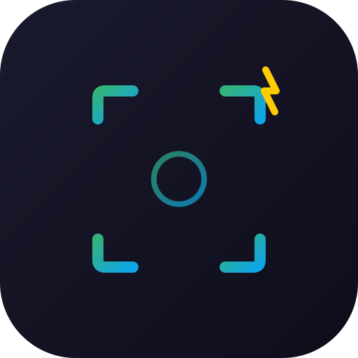
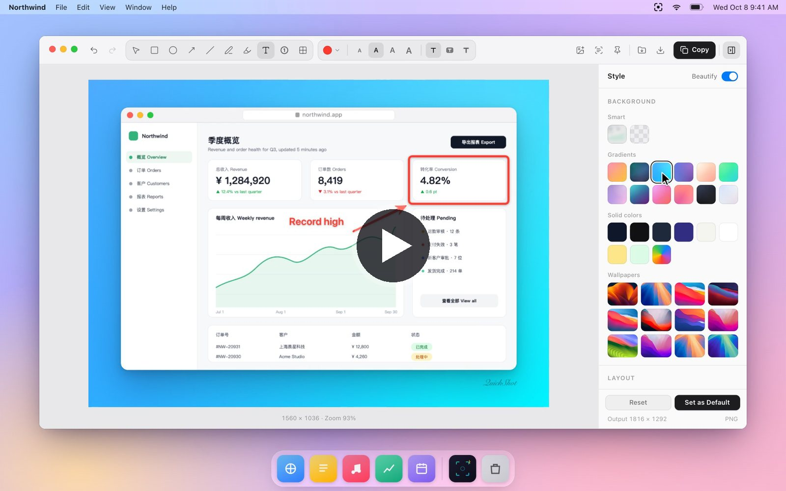
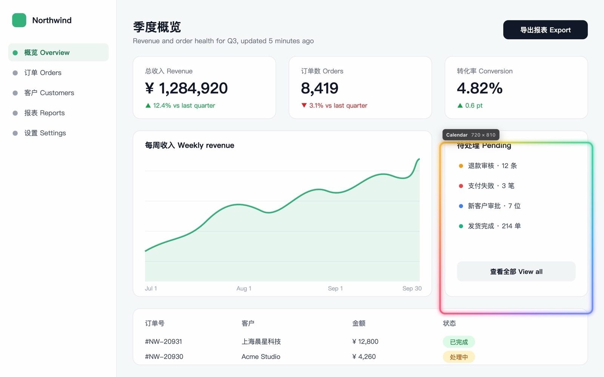
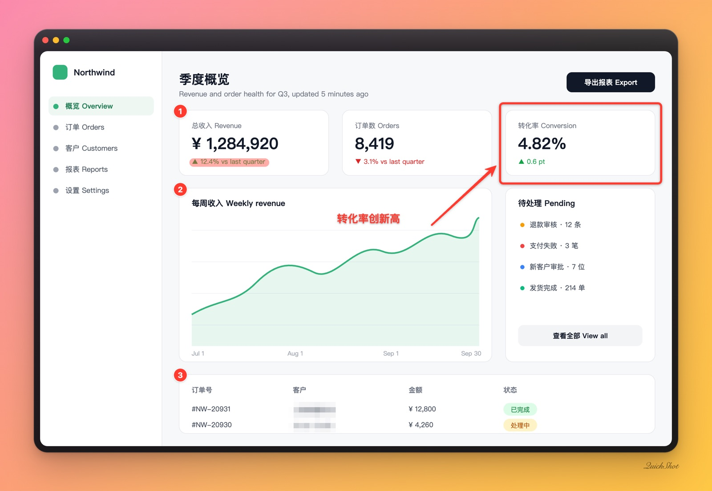

<p align="center">
  <a href="https://quickshot.lanshuagent.com"></a>
</p>

<h1 align="center">QuickShot</h1>

<p align="center">
  <b>Screenshots, beautifully simple.</b><br />
  A fast, local-first screenshot tool for macOS and Windows.<br />
  Hover to find a window, click to capture it, then annotate, beautify and stitch. Everything stays on your computer.
</p>

<p align="center">
  <a href="https://github.com/cclank/quickshot/releases/latest"></a>
  <a href="https://github.com/cclank/quickshot/releases"></a>
  <a href="https://github.com/cclank/quickshot/actions/workflows/verify.yml"></a>
  <a href="https://github.com/cclank/quickshot/actions/workflows/release.yml"></a>
  <a href="LICENSE"></a>
  <a href="https://github.com/cclank/quickshot/stargazers"></a>
  <a href="https://x.com/LufzzLiz"></a>
</p>

<p align="center">
  
  
  
  
  
  
  
  
</p>

<p align="center">
  <a href="https://quickshot.lanshuagent.com"><b>Website</b></a> ·
  <a href="#download"><b>Download</b></a> ·
  <a href="README.zh-CN.md">简体中文</a> ·
  <a href="#features">Features</a> ·
  <a href="#keyboard-shortcuts">Shortcuts</a> ·
  <a href="#development">Development</a>
</p>

<p align="center">
  <a href="https://quickshot.lanshuagent.com"></a>
  <br />
  <sub>Click to watch the demos: window capture, area capture, annotation, styles, signature, default style, stitching, pinning and text extraction.</sub>
</p>

## Highlights

| | |
| --- | --- |
| **Hover a window, click, done** | The screen stays exactly as it is. The window under the pointer lights up in a spectrum outline; click to capture just that window, drag for any area, or click the desktop for the full screen. |
| **Ten annotation tools, one key each** | Boxes, arrows, numbered steps, text, highlighter and blur, all still editable after you draw them. |
| **Presentation-ready in one click** | Gradients, window frames, rounded corners, soft shadows, aspect ratios and your own signature. Set a style as the default and every new capture starts that way. |
| **Stitch several captures** | Add another capture with `Mod+Shift+A`, or paste and drop images, then lay them out vertically, horizontally or in a grid. |
| **Pin and read** | Float a capture above everything, or pull out its text with on-device OCR. |
| **Private by design** | No network code, no account, no telemetry. Screenshots never leave your computer. |

## Download

| Platform | Installer |
| --- | --- |
| macOS · Apple silicon | `QuickShot-Mac-arm64-<version>.dmg` |
| macOS · Intel | `QuickShot-Mac-x64-<version>.dmg` |
| Windows 10 / 11 (64-bit) | `QuickShot-Win-x64-<version>-Setup.exe` |

Get them from the [latest release](https://github.com/cclank/quickshot/releases/latest) or the [website](https://quickshot.lanshuagent.com/#download). Installation notes are [below](#install).

## Features

### Capture

- **One shortcut, anywhere.** `⌘⇧X` on macOS, `Ctrl+Shift+X` on Windows, or click the tray icon.
- **QuickShot selection** (default): the screen stays exactly as it is. Hover to ring the window under the pointer in a soft spectrum and click to capture just that window, or drag to capture an area. Either way the editor opens straight away. On macOS a window is captured on its own, so overlapping windows are left out and rounded corners stay transparent.
- **System selection** (optional on macOS, via the tray menu → Selection Style): the native crosshair, including `Space` to capture a single window.
- The editor window is kept warm in the background, so it opens the moment you finish selecting.

<p align="center">
  
</p>

### Annotate

Ten tools, each on a single key: **select, rectangle, ellipse, arrow, line, pen, highlighter, text, numbered steps, and redaction** (pixelate or blur).

- Every annotation stays editable. Select it to move, resize, recolor, restyle, duplicate or delete it.
- Hold `Shift` for squares, circles and 45° lines. Drawing tools pick up existing marks of the same kind, so an arrow can still start on the edge of a box.
- Text supports plain, background and outline styles, multiple lines, and Chinese/Japanese input methods.
- Sizes follow the capture's pixel density, so annotations look the same on Retina and standard displays.
- Unlimited undo and redo.

### Stitch

- Press **Stitch** (`Mod+Shift+A`) in the editor to take another capture and join it to the current one. Pasting or dropping an image adds it too.
- Arrange the captures vertically, horizontally or in a grid, with adjustable spacing and alignment. Reorder or remove any capture.
- Annotations move with the capture they were drawn on, and every change can be undone. Beautify, export, pin and text extraction work on the stitched image.

### Beautify

- Curated mesh gradients, wallpapers, solid colors, a blurred copy of the capture itself, or a transparent background.
- Window frames: classic card, frosted glass, macOS dark and light, and a browser window.
- Padding, corner radius, layered soft shadows and social-ready aspect ratios (1:1, 4:3, 16:9, 3:4, 9:16).
- An optional signature watermark that picks a readable color automatically.
- Turn **Beautify** off to export the plain capture with annotations.

<p align="center">
  
</p>

### Share

- Copy to the clipboard, save to Downloads, or Save As.
- Pin a capture as a floating, always-on-top reference with adjustable opacity and click-through.
- Extract text from the capture on-device, with Apple Vision on macOS and Windows OCR on Windows.

### Private by design

Screenshots never leave your computer. There is no network code, no account and no telemetry. The renderer runs with context isolation, no Node.js access and an allow-listed IPC bridge.

## Keyboard shortcuts

`Mod` is `⌘` on macOS and `Ctrl` on Windows.

| Where | Shortcut | Action |
| --- | --- | --- |
| Anywhere | `Mod+Shift+X` | Capture a region |
| Anywhere | `Mod+Shift+L` | Restore interaction with click-through pins |
| Selecting | Click / drag | Capture the window under the pointer / an area, then edit |
| Selecting | Right-click / `Esc` | Cancel |
| Editor | `V` `R` `O` `A` `L` `P` `H` `T` `N` `M` | Select, rectangle, ellipse, arrow, line, pen, highlighter, text, counter, redact |
| Editor | `Mod+Z` / `Mod+Shift+Z` | Undo / redo |
| Editor | `Mod+C` | Copy the final image |
| Editor | `Mod+Enter` | Copy and close |
| Editor | `Mod+S` / `Mod+Shift+S` | Save to Downloads / Save As |
| Editor | `Mod+Shift+P` / `Mod+Shift+T` | Pin / extract text |
| Editor | `Mod+Shift+A`, `Mod+V` | Stitch another capture / a copied image |
| Editor | `Mod+D`, `Delete`, arrow keys | Duplicate, delete, nudge the selected annotation |
| Editor | `[` / `]` | Thinner / thicker |
| Editor | `Mod+.` | Show or hide the style panel |
| Editor | `Esc` | Deselect, then close |

## Install

Download the latest installer from [Releases](https://github.com/cclank/quickshot/releases/latest):

- **macOS:** `QuickShot-Mac-arm64-<version>.dmg` (Apple Silicon) or `-x64-` (Intel).
  1. Open the DMG and drag QuickShot into Applications.
  2. If macOS blocks the first launch (the app is not notarized), run this in Terminal, then open QuickShot again:
     ```bash
     sudo xattr -rd com.apple.quarantine /Applications/QuickShot.app
     ```
     Or click **Open Anyway** in System Settings → Privacy & Security.
  3. A welcome guide shows the shortcut and walks you through allowing Screen Recording. Reopen it any time from the menu bar icon.
- **Windows:** `QuickShot-Win-x64-<version>-Setup.exe`. Text extraction uses the OCR languages installed in Windows Settings.

QuickShot lives in the menu bar (macOS) or the notification area (Windows). The tray menu offers the selection style, language, launch at login and diagnostics.

## Development

Requirements: Node.js 20.19+ or 22.12+, and Xcode Command Line Tools on macOS for the OCR helper.

```bash
git clone https://github.com/cclank/quickshot.git
cd quickshot
npm install
npm run dev
```

`npm run dev:ui` serves the editor and the selection overlay against HTML fixtures, without Electron or screen permissions. It is the fastest way to work on the interface:

- Editor: `http://localhost:5188/test-fixtures/screenshot-preview.html?windowType=screenshot-preview&sessionId=1&fixtureSource=/test-fixtures/sample-ui.svg&scaleFactor=2`
- Selection: `http://localhost:5188/test-fixtures/region-selector.html?windowType=screenshot-region`

Development-only environment variables (ignored by packaged builds):

| Variable | Effect |
| --- | --- |
| `QUICKSHOT_USER_DATA_DIR` | Use a separate profile, so a dev build never shares state or the single-instance lock with an installed copy |
| `QUICKSHOT_DEV_CAPTURE_FILE` | Use this PNG instead of the screen, so the whole capture flow runs without Screen Recording permission |
| `QUICKSHOT_ENABLE_DEV_SHORTCUT=0` | Do not register the global capture shortcut |
| `QUICKSHOT_DEV_REMOTE_DEBUGGING_PORT` | Expose the Chrome DevTools Protocol for automated checks |
| `QUICKSHOT_DEV_SETTINGS_BUNDLE` | Test the Screen Recording helper against another app's window (e.g. `com.apple.finder`) instead of opening System Settings |

### Scripts

| Command | Purpose |
| --- | --- |
| `npm run dev` | Vite with Electron |
| `npm run dev:ui` | Renderer-only fixtures for UI work |
| `npm test` | Unit tests |
| `npm run verify` | Tests, type check, production build and bundle budgets |
| `npm run test:ocr-helper` | Build and smoke-test the macOS OCR helper |
| `npm run build:mac` | macOS DMGs (arm64 and x64) |
| `node scripts/render-dmg-background.mjs` | Re-render the DMG background from `installer/dmg-background.html` |
| `node scripts/record-site-demos.mjs` | Re-record the landing page videos in `site/assets/video` (needs `npm run dev:ui` running, Chrome, ffmpeg and cwebp) |
| `npm run build:win` | Windows NSIS installer |

### Project structure

```text
electron/                 Main process: tray, capture, windows, IPC, OCR
  main.ts                 Capture flow and window lifecycle
  preload.ts              The only bridge exposed to the renderer
  windowsOcr.ts           Windows.Media.Ocr through PowerShell
src/
  editor/                 Pure editor logic: annotations, geometry, layout, rendering
  components/editor/      Editor UI: toolbar, context bar, style panel, canvas stage
  components/screenshot/  Selection overlay, pinned window, text extraction panel
native/quickshot-ocr/     Apple Vision OCR helper for macOS
native/quickshot-window-list/  Window detection helper for the macOS overlay
native/quickshot-capture-agent/ Resident ScreenCaptureKit helper: screen, window and window-list capture
test-fixtures/            Browser fixtures for the editor and overlay
scripts/                  Build verification, packaging and fixture capture tools
```

## Releasing

Pushing a `v*` tag runs `.github/workflows/release.yml`, which builds the macOS DMGs and the Windows installer and attaches them to a draft GitHub release. Signing and notarization are used when the repository has `CSC_LINK`, `CSC_KEY_PASSWORD`, `APPLE_ID`, `APPLE_APP_SPECIFIC_PASSWORD` and `APPLE_TEAM_ID` secrets. Keep the macOS signing identity stable across releases: changing it makes macOS ask for Screen Recording permission again.

## Contributing

Issues and pull requests are welcome. Please read [CONTRIBUTING.md](CONTRIBUTING.md) first.

## Project origins and wallpaper notice

QuickShot's early implementation grew out of OpenScreen's screenshot work. The current resource loader and renderer build configuration have been reworked for QuickShot. We acknowledge the project's origins and thank OpenScreen's author, Siddharth Vaddem; the original code copyright and MIT terms are preserved in [THIRD_PARTY_NOTICES.md](THIRD_PARTY_NOTICES.md).

The bundled `public/wallpapers/wallpaper1.jpg` through `wallpaper12.jpg`, together with their thumbnails, were inherited from [this historical OpenScreen asset directory](https://github.com/siddharthvaddem/openscreen/tree/5320f76aaed3e543fe66b105cfaca6987904f661/public/wallpapers). These images are third-party assets; QuickShot does not claim authorship. Their original creators and redistribution permissions have not yet been verified. A license for QuickShot's code does not grant rights to these images. Anyone redistributing them must separately confirm the necessary permissions; this notice does not replace authorization. If you hold rights to an image, please contact the maintainers through a repository issue so its attribution, permission or inclusion can be corrected.

## Author

QuickShot is built by **岚叔** ([@cclank](https://github.com/cclank) on GitHub, [@LufzzLiz](https://x.com/LufzzLiz) on X).

## License

QuickShot's source code is released under the [GNU General Public License v3.0](LICENSE). Third-party code keeps its own license, listed in [THIRD_PARTY_NOTICES.md](THIRD_PARTY_NOTICES.md). The bundled wallpapers are not covered by this license; see the notice above.
