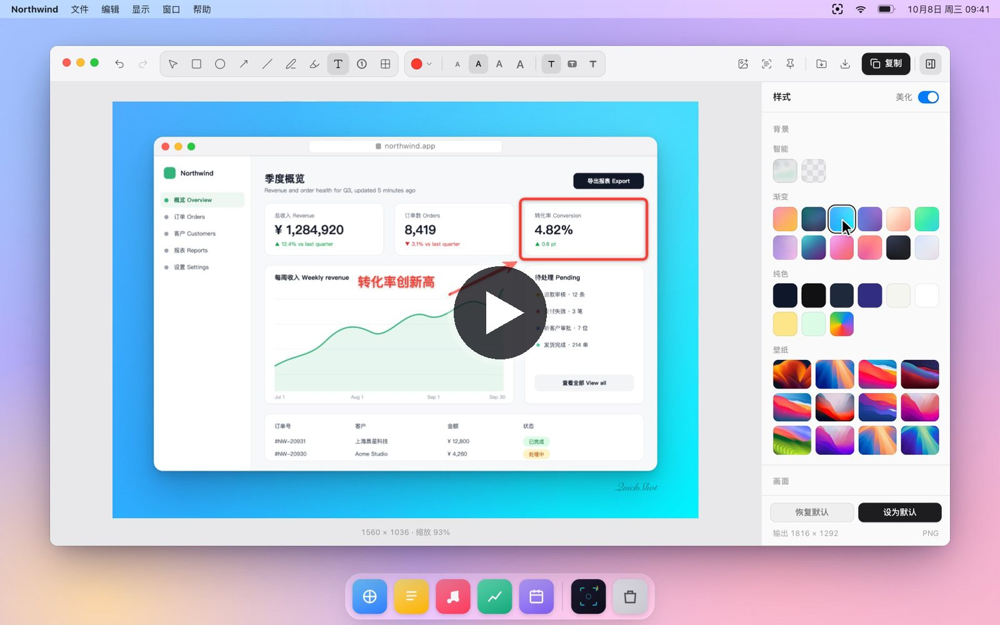

<p align="center">
  <a href="https://quickshot.lanshuagent.com"></a>
</p>

<h1 align="center">QuickShot</h1>

<p align="center">
  <b>截图，本该如此优雅。</b><br />
  快速、完全本地运行的截图工具，支持 macOS 与 Windows。<br />
  悬停识别窗口，单击即截；标注、美化、拼接，几秒钟得到可以直接分享的成品图，全程只在你的电脑上完成。
</p>

<p align="center">
  <a href="https://github.com/cclank/quickshot/releases/latest"></a>
  <a href="https://github.com/cclank/quickshot/releases"></a>
  <a href="https://github.com/cclank/quickshot/actions/workflows/verify.yml"></a>
  <a href="https://github.com/cclank/quickshot/actions/workflows/release.yml"></a>
  <a href="LICENSE"></a>
  <a href="https://github.com/cclank/quickshot/stargazers"></a>
  <a href="https://x.com/LufzzLiz"></a>
</p>

<p align="center">
  
  
  
  
  
  
  
  
</p>

<p align="center">
  <a href="https://quickshot.lanshuagent.com"><b>官网</b></a> ·
  <a href="#下载"><b>下载</b></a> ·
  <a href="README.md">English</a> ·
  <a href="#功能">功能</a> ·
  <a href="#快捷键">快捷键</a> ·
  <a href="#开发">开发</a>
</p>

<p align="center">
  <a href="https://quickshot.lanshuagent.com"></a>
  <br />
  <sub>点击观看演示：截取窗口、框选区域、标注、美化样式、署名、设为默认、拼接、贴图与文字识别。</sub>
</p>

## 亮点

| | |
| --- | --- |
| **悬停识别窗口，单击即截** | 屏幕保持原样，鼠标下的窗口亮起彩虹轮廓；单击截取这个窗口，拖动截取任意区域，点桌面截取整个屏幕。 |
| **十种标注工具，一键一种** | 方框、箭头、序号、文字、荧光笔、打码，画完之后依然可以再次编辑。 |
| **一键变成可以发布的成品图** | 渐变背景、窗口样式、圆角、柔和阴影、画面比例，再署上你的名字。设为默认后，之后的截图都用这套样式。 |
| **多张截图拼成一张** | 按 `Mod+Shift+A` 再截一张，或直接粘贴、拖入图片，纵向、横向、网格随意排列。 |
| **贴到桌面，提取文字** | 截图置顶悬浮在桌面上对照，本机识别图中的文字；智能打码一键遮住用户名、主机名、邮箱、IP 和密钥。 |
| **隐私优先** | 截图始终留在你的电脑上，没有账号、没有云端，只有一个匿名启动计数。 |

## 下载

| 平台 | 安装包 |
| --- | --- |
| macOS · Apple 芯片 | `QuickShot-Mac-arm64-<版本>.dmg` |
| macOS · Intel | `QuickShot-Mac-x64-<版本>.dmg` |
| Windows 10 / 11（64 位） | `QuickShot-Win-x64-<版本>-Setup.exe` |

在 [最新版本](https://github.com/cclank/quickshot/releases/latest) 或 [官网](https://quickshot.lanshuagent.com/#download) 下载，安装说明见[下文](#安装)。

## 功能

### 截图

- **一个快捷键随处可用。** macOS 为 `⌘⇧X`，Windows 为 `Ctrl+Shift+X`，也可以点击托盘图标。
- **QuickShot 选区**（默认）：屏幕保持原样，不变暗也不变色。鼠标悬停时为应用窗口描出一圈彩虹轮廓，单击即截取这个窗口，拖动则截取任意区域，松手直接进入编辑器。macOS 上会单独截取窗口本身，不会带进叠在上面的其他窗口，圆角外保持透明。
- **系统选区**（macOS 可选，在托盘菜单 → 选区方式中切换）：原生十字准星，按 `空格` 可切换为单窗口截图。
- 编辑窗口在后台预热，框选结束即刻打开。

<p align="center">
  
</p>

### 标注

十种工具，各对应一个按键：**选择、矩形、椭圆、箭头、直线、画笔、荧光笔、文字、序号、打码**（像素化或模糊）。

- 每个标注都可以再次编辑：选中后可移动、缩放、改色、换样式、复制或删除。
- **智能打码**（`Mod+Shift+M`，或打码工具栏里的按钮）：在本机识别图中文字，一次打码本机用户名和主机名（终端提示符 `用户名@主机名`、`ls -l` 里的属主）、`/Users/用户名` 这类路径里的用户名、邮箱、IP 和 MAC 地址，以及 `sk-…`、`ghp_…`、`AKIA…` 等常见密钥和 `KEY=值` 里的值。可以整体撤销；它只是辅助，发送前请再看一眼。
- 按住 `Shift` 画正方形、正圆和 45° 线。绘图工具只会抓取同类标注，箭头可以从方框边缘直接画出。
- 文字支持普通、底色、描边三种样式和多行输入，兼容中文输入法。
- 标注尺寸按截图像素密度换算，Retina 屏与普通屏效果一致。
- 撤销与重做不限次数。

### 拼接

- 在编辑器里点**拼接**（`Mod+Shift+A`）再截一张，会接到当前截图上；粘贴或拖入图片也能拼进来。
- 支持纵向、横向、网格三种排列，间距和对齐方式可调，每张截图都能调整顺序或移除。
- 标注会跟着它所在的那张截图一起移动，所有改动都能撤销。美化、导出、贴图和文字提取都作用于拼好的整张图。

### 美化

- 精选渐变、壁纸、纯色、截图自身的模糊背景，或透明背景。
- 窗口样式：经典卡片、磨砂玻璃、macOS 深色与浅色、浏览器窗口。
- 可调边距、圆角、多层柔和阴影，以及适合社交平台的比例（1:1、4:3、16:9、3:4、9:16）。
- 可选的署名水印，颜色可按画面自动调整。
- 关闭**美化**即可导出原始截图加标注。

<p align="center">
  
</p>

### 分享

- 复制到剪贴板、保存到“下载”、另存为。
- 贴到桌面：置顶悬浮，可调透明度并开启鼠标穿透。
- 本机提取文字：macOS 使用 Apple Vision，Windows 使用系统自带 OCR。

### 隐私

截图和其中的文字始终留在本机，没有账号，也没有云端。从 1.2.0 起，QuickShot 每次启动会发送一次匿名统计，用来了解有多少人在使用：随机安装 ID、应用版本、系统及版本、CPU 架构，不包含任何截图内容。如需关闭，在 `settings.json`（macOS 位于 `~/Library/Application Support/quickshot/`，Windows 位于 `%APPDATA%\quickshot\`）中加入 `"usageStats": false` 并重启 QuickShot；开发版不会发送。渲染进程开启上下文隔离，禁用 Node.js，只通过白名单 IPC 与主进程通信。

## 快捷键

`Mod` 在 macOS 上是 `⌘`，在 Windows 上是 `Ctrl`。全局截图快捷键可以在菜单栏的“设置…”里修改，也可以给滚动截图单独设一个。

| 场景 | 快捷键 | 作用 |
| --- | --- | --- |
| 任意位置 | `Mod+Shift+X` | 截图 |
| 任意位置 | `Mod+Shift+L` | 恢复开启了鼠标穿透的贴图 |
| 选区 | 单击 / 拖动 | 截取鼠标下的窗口 / 任意区域，随后进入编辑器 |
| 选区 | 右键 / `Esc` | 取消 |
| 编辑器 | `V` `R` `O` `A` `L` `P` `H` `T` `N` `M` | 选择、矩形、椭圆、箭头、直线、画笔、荧光笔、文字、序号、打码 |
| 编辑器 | `Mod+Z` / `Mod+Shift+Z` | 撤销 / 重做 |
| 编辑器 | `Mod+C` | 复制成品图 |
| 编辑器 | `Mod+Enter` | 复制并关闭 |
| 编辑器 | `Mod+S` / `Mod+Shift+S` | 保存到“下载” / 另存为 |
| 编辑器 | `Mod+Shift+P` / `Mod+Shift+T` | 贴到桌面 / 提取文字 |
| 编辑器 | `Mod+Shift+M` | 智能打码 |
| 编辑器 | `Mod+Shift+A`、`Mod+V` | 再截一张拼接 / 拼接剪贴板里的图片 |
| 编辑器 | `Mod+D`、`Delete`、方向键 | 复制一份、删除、微调选中的标注 |
| 编辑器 | `[` / `]` | 变细 / 变粗 |
| 编辑器 | `Mod+.` | 显示或隐藏样式面板 |
| 编辑器 | `Esc` | 取消选中，再按一次关闭 |

## 安装

在 [Releases](https://github.com/cclank/quickshot/releases/latest) 下载安装包：

- **macOS：** Apple 芯片选 `QuickShot-Mac-arm64-<版本>.dmg`，Intel 选 `-x64-`。
  1. 打开 DMG，把 QuickShot 拖进“应用程序”。
  2. 首次打开如被 macOS 拦截（应用未经公证），在“终端”运行下面这行，然后重新打开 QuickShot：
     ```bash
     sudo xattr -rd com.apple.quarantine /Applications/QuickShot.app
     ```
     也可以在“系统设置 → 隐私与安全性”页面底部点“仍要打开”。
  3. 首次启动会出现使用指南，展示快捷键并一步步引导你允许“屏幕录制”。之后可随时从菜单栏图标再次打开。
- **Windows：** `QuickShot-Win-x64-<版本>-Setup.exe`。文字提取使用 Windows 设置中已安装的 OCR 语言。

QuickShot 常驻菜单栏（macOS）或通知区域（Windows）。托盘菜单可以切换选区方式、界面语言、登录时启动，并打开诊断日志。

## 开发

需要 Node.js 20.19+ 或 22.12+；macOS 上构建 OCR 组件需要 Xcode 命令行工具。

```bash
git clone https://github.com/cclank/quickshot.git
cd quickshot
npm install
npm run dev
```

`npm run dev:ui` 只启动界面，使用 HTML 夹具渲染编辑器和选区浮层，不需要 Electron 和录屏权限，适合调整界面：

- 编辑器：`http://localhost:5188/test-fixtures/screenshot-preview.html?windowType=screenshot-preview&sessionId=1&fixtureSource=/test-fixtures/sample-ui.svg&scaleFactor=2`
- 选区：`http://localhost:5188/test-fixtures/region-selector.html?windowType=screenshot-region`（加 `&scroll=on` 进入滚动截图）
- 滚动截图面板：`http://localhost:5188/test-fixtures/scroll-capture.html?windowType=scroll-capture`

仅在开发模式生效的环境变量（安装包会忽略）：

| 变量 | 作用 |
| --- | --- |
| `QUICKSHOT_USER_DATA_DIR` | 使用独立的数据目录，开发版不会与已安装的应用共用状态或单实例锁 |
| `QUICKSHOT_DEV_CAPTURE_FILE` | 用指定 PNG 代替屏幕，无需录屏权限即可跑通完整截图流程 |
| `QUICKSHOT_DEV_SCROLL_FIXTURE` | macOS：滚动截图（`--capture-scroll`）改为在这张长 PNG 上模拟滚动，不读取屏幕 |
| `QUICKSHOT_ENABLE_DEV_SHORTCUT=0` | 不注册全局快捷键（截图快捷键，以及滚动截图时的 Esc / 回车） |
| `QUICKSHOT_DEV_REMOTE_DEBUGGING_PORT` | 开放 Chrome DevTools 协议端口，便于自动化检查 |
| `QUICKSHOT_DEV_USAGE_STATS=1` | 让开发版也发送匿名使用统计（默认不发）；`QUICKSHOT_DEV_USAGE_STATS_ENDPOINT` 可改为其他地址，例如本地测试服务 |
| `QUICKSHOT_DEV_SETTINGS_BUNDLE` | 用其他 App 的窗口（如 `com.apple.finder`）代替系统设置，测试录屏授权浮条，不会真的打开系统设置 |

常用命令：`npm test` 运行单元测试，`npm run verify` 运行测试、类型检查、生产构建与体积预算检查，`npm run test:scroll-stitcher` 用合成页面检查 macOS 滚动截图的拼接，`npm run build:mac` / `npm run build:win` 打包安装程序。

官网在 `site/`，是一个静态页面。演示视频用真实的选区浮层和编辑器在演示桌面（`test-fixtures/demo/`）上录制：先运行 `npm run dev:ui`，再运行 `node scripts/record-site-demos.mjs` 重新生成 `site/assets/video/`（需要 Chrome、ffmpeg 和 cwebp）。

## 发布

推送 `v*` 标签会运行 `.github/workflows/release.yml`，构建 macOS DMG 和 Windows 安装包并附到草稿 Release。`CSC_LINK`、`CSC_KEY_PASSWORD` 存放 macOS 发布证书，配置后 macOS 包会用它签名，并在构建后核对签名身份；证书的来历和配置步骤见 [docs/release-signing.md](docs/release-signing.md)。配置了 `APPLE_ID`、`APPLE_APP_SPECIFIC_PASSWORD`、`APPLE_TEAM_ID` 时还会公证，这需要 Apple 的 Developer ID 证书。macOS 签名身份需要在各版本间保持一致，否则系统会重新要求录屏授权。

Release 里还会附带 `latest.json`，这是 QuickShot 读取的更新信息（见 `electron/updates.ts`）。已安装的 QuickShot 先查 `dl.lanshuagent.com/quickshot/latest.json`，再查 GitHub 最新 Release 上的同名文件，两者都失败时才调用 GitHub 接口。启动时和每隔 6 小时检查一次；发现新版只提示，用户确认后才下载，并在校验 SHA-256 之后安装。草稿 Release 正式发布后，把它同步到下载服务器：

```bash
WRANGLER=/path/to/wrangler node scripts/publish-update-feed.mjs vX.Y.Z
```

用 `npm run install:mac:local` 安装的本机构建不会自动检查更新，避免公开版本覆盖尚未发布的本地修复。

## 参与贡献

欢迎提交 Issue 和 Pull Request，请先阅读 [CONTRIBUTING.md](CONTRIBUTING.md)。

## 项目来源与壁纸声明

QuickShot 的早期实现由 OpenScreen 的截图相关工作发展而来。当前资源加载逻辑和界面构建配置已针对 QuickShot 重新实现与整理。我们保留项目来源记录，感谢 OpenScreen 原作者 Siddharth Vaddem，并在 [THIRD_PARTY_NOTICES.md](THIRD_PARTY_NOTICES.md) 中保留原代码的版权声明和 MIT 许可全文。

内置的 `public/wallpapers/wallpaper1.jpg` 至 `wallpaper12.jpg` 及其缩略图，继承自 [OpenScreen 的这一历史素材目录](https://github.com/siddharthvaddem/openscreen/tree/5320f76aaed3e543fe66b105cfaca6987904f661/public/wallpapers)。这些图片属于第三方素材，QuickShot 不主张其原创权。图片的原始作者与再分发授权尚未逐项核实，QuickShot 代码的许可证不授予这些图片的使用权。再次分发前须单独确认所需授权，本声明不能代替授权。如您持有某张图片的权利，请通过仓库 Issue 联系维护者，以便补充署名、许可或调整收录。

## 作者

QuickShot 由 **岚叔** 开发（GitHub：[@cclank](https://github.com/cclank)，X：[@LufzzLiz](https://x.com/LufzzLiz)）。

## 许可证

QuickShot 的源代码以 [GNU 通用公共许可证 v3.0](LICENSE) 发布。第三方代码沿用各自的许可证，见 [THIRD_PARTY_NOTICES.md](THIRD_PARTY_NOTICES.md)。内置壁纸不在此许可证范围内，见上方声明。
